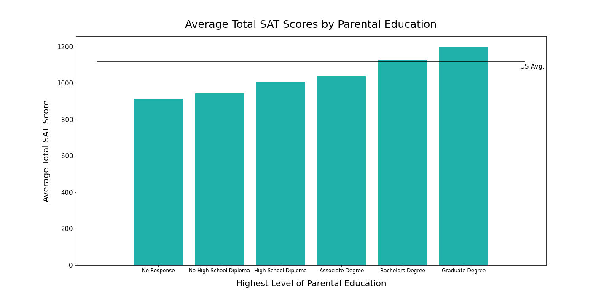
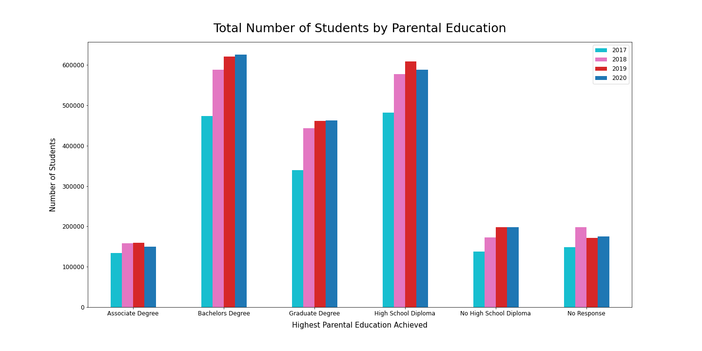
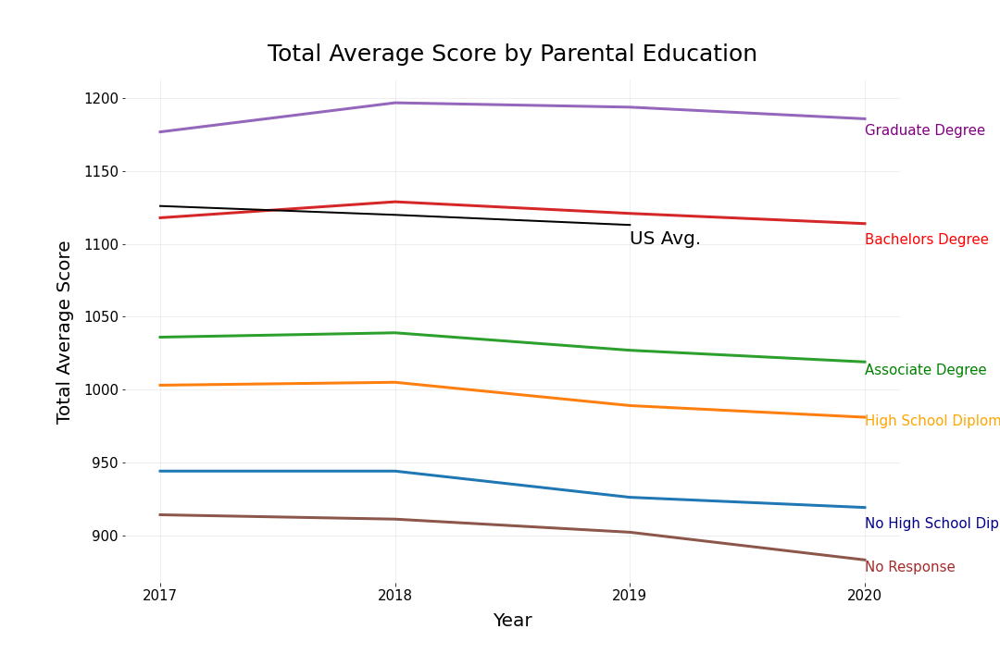
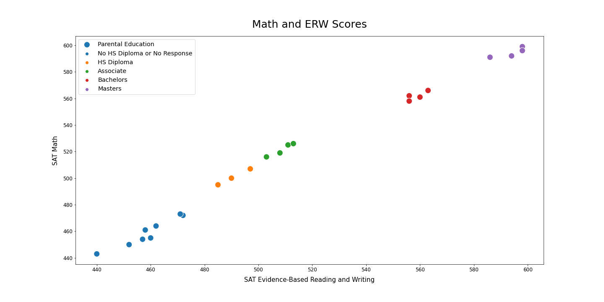
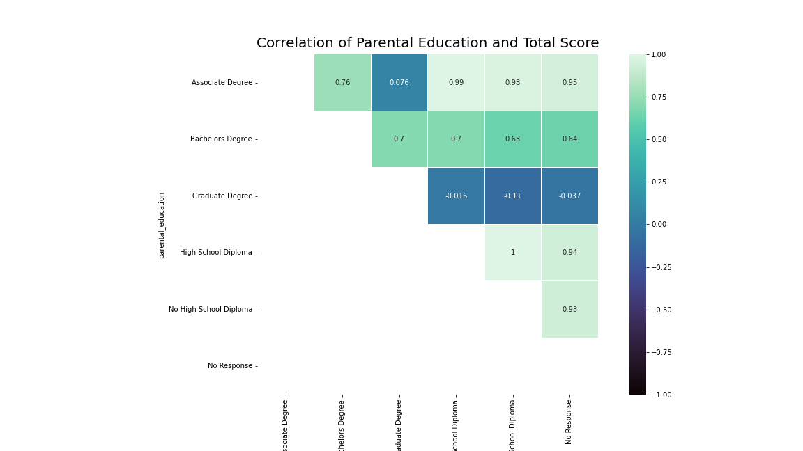

# SAT Scores and Level of Parental Education

## Problem Statement

This study aims to evaluate if there is a correlation between parental education levels and student SAT participation and scores. 

## Contents:
- [Background](#Background)
- [Datasets](#Datasets)
- [Data Dictionary](#Data-Dictionary)
- [Summary of Analysis](#Summary-of-Analysis)
- [Data Visualization](#Data-Visualization)
- [Conclusions and Recommendations](#Conclusions-and-Recommendations)

## Background

In 2020, over 2.1 million students took the SAT. As school districts continue to educate and prepare students to achieve their best results on standardized tests, the level of the students parental education may impact the student scores. We will be looking at the relationship between parental education achieved and SAT student scores and participation from 2017 to 2020.

## Datasets

I used these datasets to analyze the U.S. average SAT scores per year:

* [`sat_2017.csv`](./data/sat_2017.csv): 2017 SAT Scores by State ([source](https://blog.collegevine.com/here-are-the-average-sat-scores-by-state/))
* [`sat_2018.csv`](./data/sat_2018.csv): 2018 SAT Scores by State ([source](https://blog.collegevine.com/here-are-the-average-sat-scores-by-state/))
* [`sat_2019.csv`](./data/sat_2019.csv): 2019 SAT Scores by State ([source](https://blog.prepscholar.com/average-sat-scores-by-state-most-recent))

I used these datasets from CollegeBoard reports to analyze the levels of parental education and how they correlate with SAT scores and participation: 

* [`sat_parental_education_2017.csv`](./data/sat_parental_education_2017.csv): 2017 SAT Scores by Level of Parental Education ([source](https://reports.collegeboard.org/pdf/2017-total-group-sat-suite-assessments-annual-report.pdf))
* [`sat_parental_education_2018.csv`](./data/sat_parental_education_2018.csv): 2018 SAT Scores by Level of Parental Education ([source](https://reports.collegeboard.org/pdf/2018-total-group-sat-suite-assessments-annual-report.pdf))
* [`sat_parental_education_2019.csv`](./data/sat_parental_education_2019.csv): 2019 SAT Scores by Level of Parental Education ([source](https://reports.collegeboard.org/pdf/2019-total-group-sat-suite-assessments-annual-report.pdf))
* [`sat_parental_education_2020.csv`](./data/sat_parental_education_2020.csv): 2020 SAT Scores by Level of Parental Education ([source](https://reports.collegeboard.org/pdf/2020-total-group-sat-suite-assessments-annual-report.pdf))

## Data Dictionary

|Feature|Type|Dataset|Description|
|---|---|---|---|
|year|int|sat_scores and education|The year represents the year the SAT was completed.| 
|state|object|sat_scores| The state represents the state the SAT data was collected in.| 
|participation|float|sat_scores| The average participation rate of SAT test participants by year.| 
|total|int|sat_scores and education|The SAT Total average score by year.| 
|erw|int|sat_scores and education|The SAT Evidence-Based Reading and Writing average score by year.| 
|math|int|sat_scores and education|The SAT Math average score by year.| 
|parental_education|object|education|The highest level of parental education achieved.|
|p_edu|int|education|Indicates level of parental education by integers. 0: No High School Diploma or No Response, 1: High School Diploma, 2: Associate Degree, 3: Bachelors Degree, 4: Graduate Degree |
|number_of_test_takers|int|education|The number of test participants grouped by parental education achieved.|
|percentage_of_test_takers|float|education|The percentage of test participants grouped by parental education achieved.|

## Summary of Analysis 

Student SAT scores are strongly correlated to parental education levels. The higher the parental education, the higher the student's score tends to be. Students with a parental education level of a Graduate Degree scored roughly 69 points higher than the U.S. average score, 94 points higher than students with a parental education of a High School Diploma and 225 points higher than the average student score with a parental education of No High School Diploma. Students with a parental education of a Bachelors Degree scored slightly higher than the U.S. average. Students with a parental education of an Associates Degree or lower scored lower than the U.S. average. 2020 SAT scores were lower than 2018 and 2019 scores, regardless of parental education. 

Students with a parental education of a Bachelor's Degree made up the largest portion of students taking the SAT over the last four years. In 2020, 28% of students taking the SAT had a parental education of a Bachelor's Degree. High School parental education followed closely, representing 27% of the students who took the SAT. 

There was a lower number of test takers with a parental education of Associate Degree, High School Diploma, and No High School Diploma in 2020 compared to 2019. The number of test takers with a parental education of a Bachelors or Graduate degree increased by less than a percent from 2019 to 2020.

## Data Visualization

Here are a few examples of how I visualized the data. 

## Conclusions and Recommendations

The level of parental education has an impact on student SAT scores and participation. 

Further research and analysis are recommended, and should include the following areas: 
- Evaluate state level parental education
- Evaluate county and school district level parental education
- Evaluate participation rates by parental education
- Evaluate household income vs. parental education

Due to the decrease in the number of students taking the SAT, evaluate whether students with/without parental education are applying to schools that may not require SAT scores or if they are in states that do not require participation.

I would recommend looking into potential reasons why students do not respond to the parental education section and how it correlates with the average low score of those who do not respond.

Finally, I would recommend developing programs to provide resources for those students who may not have parents/parental figures with higher levels of education.
